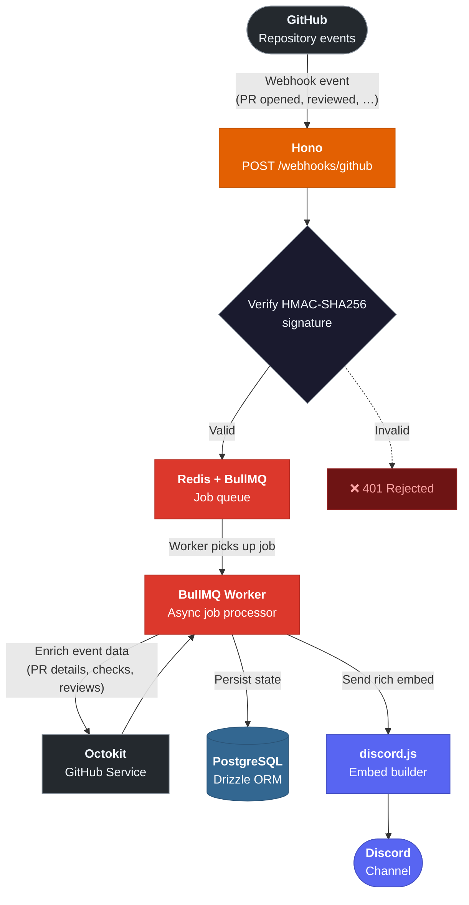

# NEXTGEN Architecture

This document outlines the system architecture for various modules and features within NEXTGEN.

## GitHub PR Tracking

**In a nutshell:**

1. GitHub fires a webhook event (e.g. `pull_request.opened`).
2. **Hono** receives the `POST /webhooks/github` request at `src/features/github/webhooks/route.ts`.
3. The signature is verified via `src/features/github/webhooks/verify.ts` (HMAC-SHA256). Invalid payloads are rejected with a `401`.
4. The verified payload is enqueued into a **BullMQ** job queue (Redis-backed).
5. A **BullMQ worker** (`src/features/github/workers/pr.worker.ts`) picks up the job asynchronously.
6. The worker uses **Octokit** (`src/features/github/services/github.service.ts`) to enrich the event — fetching full PR details, CI checks, and reviews.
7. State is persisted in **PostgreSQL** via **Drizzle ORM** (schema in `src/features/github/schema.ts`).
8. The worker builds a rich embed (`src/features/github/embeds/pr.embed.ts`) and sends it to the configured Discord channel via **discord.js**.

**BullMQ** also handles: scheduled syncs, retry on failure, delayed notifications, periodic cleanup, and any future background tasks.

---

### Implementation Status

✅ **Done:**
1. Hono receives the POST webhook.
2. `HMAC-SHA256` signature verification works perfectly.
3. Drizzle ORM persists the state to PostgreSQL.
4. Rich embeds are built and sent to the correct Discord channels.
5. **BullMQ Queue:** The route (`src/features/github/webhooks/route.ts`) verifies the signature, enqueues the payload into a Redis-backed BullMQ queue (`src/features/github/queue.ts`), and returns `200` to GitHub instantly.
6. **BullMQ Worker:** `src/features/github/workers/pr.worker.ts` picks up jobs asynchronously (3 attempts, exponential backoff) and processes them via `src/features/github/services/pr-handler.ts`.
7. **Octokit Enrichment:** `GitHubService` (`src/features/github/services/github.service.ts`) fetches CI check statuses (`checks.listForRef`) and review history (`pulls.listReviews`) to enrich the webhook payload. Enrichment is best-effort — on API failure the worker falls back to the raw webhook payload.
