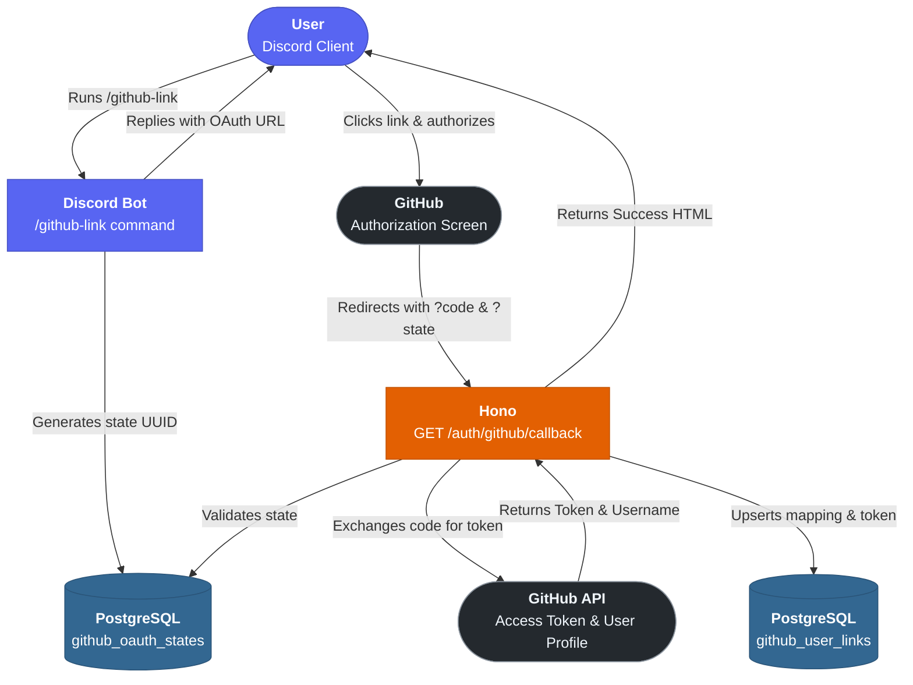

# NEXTGEN Architecture

This document outlines the system architecture for various modules and features within NEXTGEN.

## GitHub OAuth Flow

**In a nutshell:**

1. The user runs `/github-link` in Discord.
2. The bot (`src/commands/github/github-link.ts`) checks if they are already linked. It generates a secure `state` UUID, saves it to `github_oauth_states` via Drizzle ORM, and replies with an ephemeral embed containing the GitHub authorization link.
3. The user clicks the link and authorizes the application on GitHub.
4. GitHub redirects the user back to the bot's Hono server (`GET /auth/github/callback`) with a short-lived `code` and the original `state`.
5. The Hono route (`src/features/github/webhooks/auth-route.ts`) verifies the `state` against the database to prevent CSRF attacks.
6. The Hono route exchanges the `code` for an access token via the GitHub API.
7. The Hono route fetches the user's GitHub profile (`/user`) using the new access token.
8. The Discord ID, GitHub Username, and GitHub Access Token are persisted in the `github_user_links` table.
9. The user is shown a clean, responsive HTML success page and can close the tab.

---

### Implementation Status

✅ **Done:**
1. **/github-link Command:** Implemented with smart "already linked" detection and secure OAuth URL generation.
2. **CSRF Protection:** State parameters are actively tracked and validated against the `github_oauth_states` table, and deleted upon successful use.
3. **OAuth Callback Route:** Handled natively in Hono with strict error boundaries for API failures.
4. **Data Persistence:** The one-to-one mapping between Discord ID and GitHub account (plus their access token) is securely stored for future API interactions (like true authorship on issues/PRs).
5. **Success Feedback:** A polished HTML page confirms the successful link.

---

## GitHub PR Tracking

**In a nutshell:**

1. GitHub fires a webhook event (e.g. `pull_request.opened`).
2. **Hono** receives the `POST /webhooks/github` request at `src/features/github/webhooks/route.ts`.
3. The signature is verified via `src/features/github/webhooks/verify.ts` (HMAC-SHA256). Invalid payloads are rejected with a `401`.
4. The verified payload is enqueued into a **BullMQ** job queue (Redis-backed).
5. A **BullMQ worker** (`src/features/github/workers/pr.worker.ts`) picks up the job asynchronously.
6. The worker uses **Octokit** (`src/features/github/services/github.service.ts`) to enrich the event — fetching full PR details, CI checks, and reviews.
7. State is persisted in **PostgreSQL** via **Drizzle ORM** (schema in `src/features/github/schema.ts`).
8. The worker builds a rich embed (`src/features/github/embeds/pr.embed.ts`) and sends it to the configured Discord channel via **discord.js**.

**BullMQ** also handles: scheduled syncs, retry on failure, delayed notifications, periodic cleanup, and any future background tasks.

---

### Implementation Status

✅ **Done:**
1. Hono receives the POST webhook.
2. `HMAC-SHA256` signature verification works perfectly.
3. Drizzle ORM persists the state to PostgreSQL.
4. Rich embeds are built and sent to the correct Discord channels.
5. **BullMQ Queue:** The route (`src/features/github/webhooks/route.ts`) verifies the signature, enqueues the payload into a Redis-backed BullMQ queue (`src/features/github/queue.ts`), and returns `200` to GitHub instantly.
6. **BullMQ Worker:** `src/features/github/workers/pr.worker.ts` picks up jobs asynchronously (3 attempts, exponential backoff) and processes them via `src/features/github/services/pr-handler.ts`.
7. **Octokit Enrichment:** `GitHubService` (`src/features/github/services/github.service.ts`) fetches CI check statuses (`checks.listForRef`) and review history (`pulls.listReviews`) to enrich the webhook payload. Enrichment is best-effort — on API failure the worker falls back to the raw webhook payload.
8. **In-place Embed Sync:** When a `pull_request.synchronize` event occurs (e.g. new commits pushed), the bot queries `github_pr_messages` for the original Discord message IDs and seamlessly updates the original embeds in-place with refreshed CI checks and an updated footer, rather than spamming the channel with new messages.
